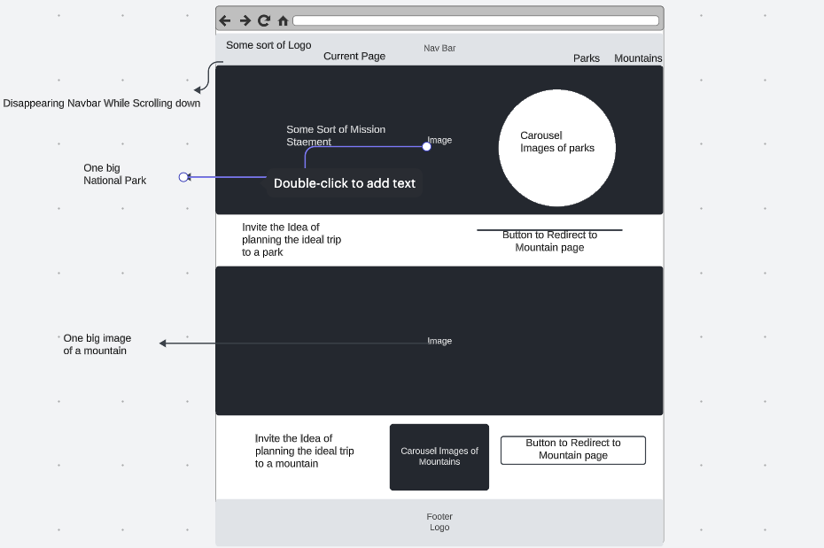
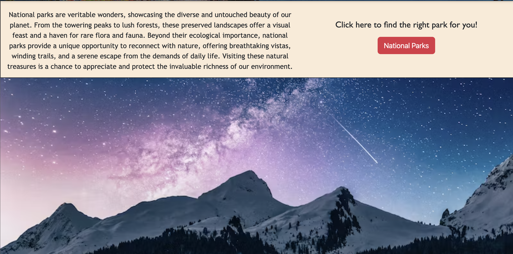
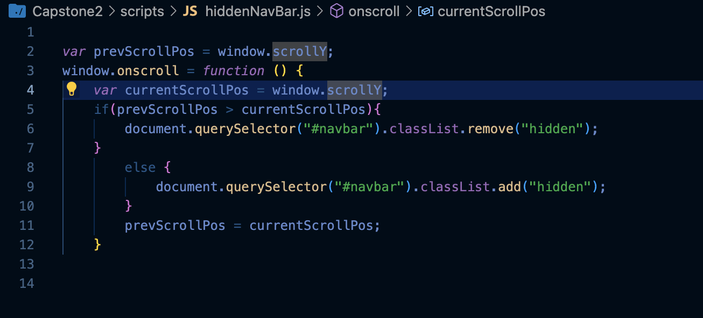
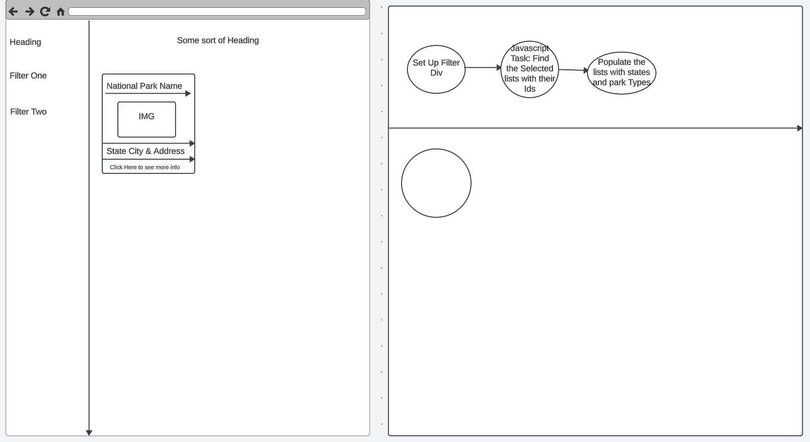
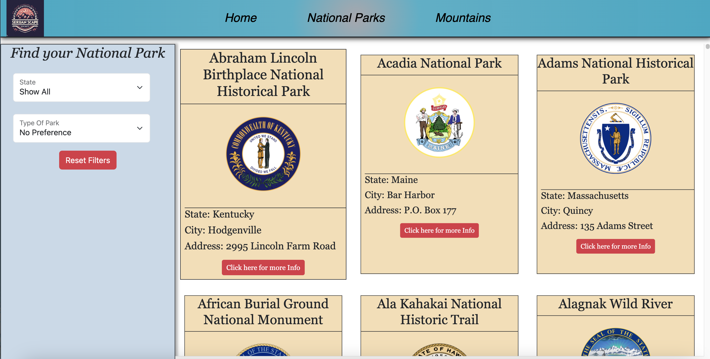
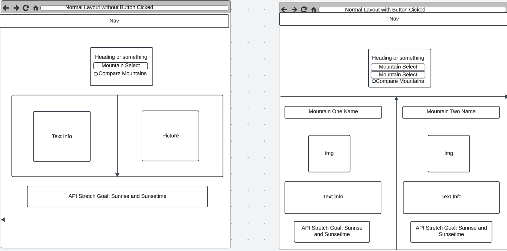
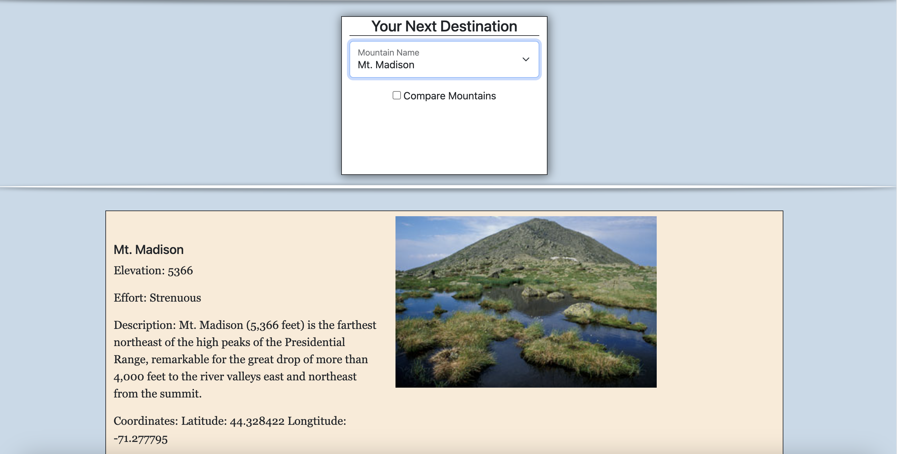

# Capstone2

Description: This project’s focus is to make a design that allows the user to find things to do and enjoy in nature. Specifically, the site helps find national parks.

Basic Requirements: 

Homepage: The page should highlight our simple organization and contain links to two other pages: a National Parks search page and a Mountains information page!

A National Parks Search Page: The National Parks search page provides a user interface that allows the user to search for the park that is just right for them. Data comes from a file named nationalParks.js provided below.

Parks Information: ~ Javascript for filtering only

Requirements for implementation and details:
Use the array provided from the zip and the nationalParkData.js file.

Two filter types; location and parktype 

Location Filter
All states are located in the locationData.js

Park type Filter: 
parkTypeData.js 
Park matches the description by checking to see if the park’s LocationName property contains the description.

Stretch Goals for Parks: 
Provide a View All National Parks Option
Some Parks provide URLs to a page about the park, display a hyperlink along with park details the user can click on.

Mountains Information Page: The mountains information page provides a user interface that allows the user to explore the details of 48 different mountains. Data will come from a file named mountains.js provided below.

Mountains Information ~ Javascript for resetting pages and displaying info

A dropdown list of the 48 mountains defined in an array in the mountainData.js file. Once a mountain is selected. Your page will display information about that mountain including:

Mountain Name
Description
Elevation
Any other information you find interesting about the mountain

Stretch Goals For Mountain:
Display the image of the mountain along with the mountain information.
Display sunset and sunrise timings by using the APIs
My own goal: A button the splits the page into two and allows mountain comparison.

Home page Planning:
I knew there were certain aesthetics I wanted but as you'll see, the final product differs a bit from what was planned. I wanted to make sure to have a unique navbar with a scrolling effect and a carousel that was inside a rounded container. Below is a snippet of the code used to acquire the effect.

Here is how the latest update to the Home Page looks like:

Below is a code snippet of the js for the disappearing NavBar

A new concept I learned from this addition to my project was the comparison of scroll distance resulting in the addition of classes. I was also able to brushen up my understanding of Css with transition effects and timing.

The planning on this next page wasn't as thorough due to knowing that the layout would be similar to a previous exercise. My goal was to create the card layout and replicate it for every national park. Once I did that, I moved onto creating the logic that the filters would process in order to display the information that is asked for.

Below is an image of the current parks page:

Some of the personal features I added/planned on adding include the insignias in each national park card and also a button that would fire a bootstrap modal and display some of the other information such as coordinates and links to other sites if avalible. 

Last but not least the planning for the mountains page would argubably be between the home page and the national park page.

The initial design on the left side would meet all the requirements for this project however I also wanted to add another stretch goal on top of the stretch goal of pulling the api of sunset and sunrise timing. The checkbox would cause the innertext of the container I was targetting to reset to nothing and then create a new layout that would be similar to a one row two column layout.

Here is the final layout:

The home page and mountains page were both responsive however the parks page wasn't due to a usage of grid and no media query. That would be the first thing that I would want to fix if I was to revisit the project.

Other things to work on include finishing the layout of the mountains page if the checkbox is clicked and making the see more buttons display all the information of the national parks.

Overall I feel that my HTML and Css skills have overall increased and my Javascript knowledge was able to be displayed. 
